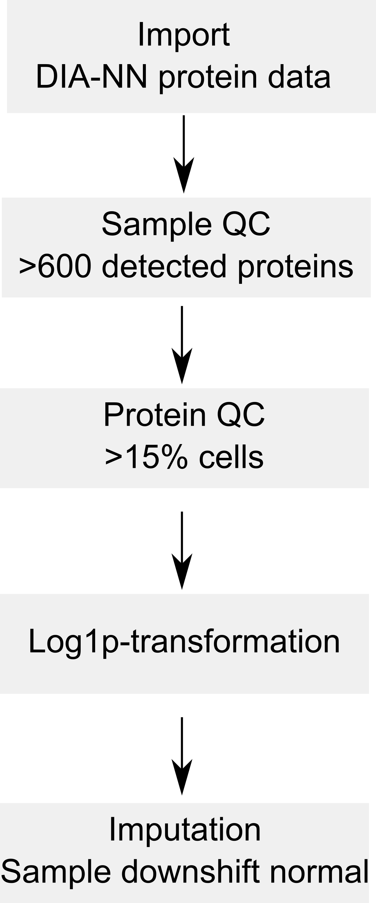

```{r setup, include = FALSE}
## Options for Rmarkdown compilation
knitr::opts_chunk$set(fig.width = 7,
                      fig.height = 5,
                      fig.align = "center",
                      out.width = "70%",
                      message = FALSE,
                      collapse = TRUE,
                      crop = NULL
)
## Time the compilation
timeStart <- Sys.time()
```

# Introduction

The study by Brunner et al. on the cell cycle is the first mass 
spectrometry-based single-cell proteomics (SCP) experiment that 
acquired hundreds of single cells using a label-free protocol 
(@Brunner2022-rd). The
data was acquired using a newly designed mass spectrometer that will 
later be released by Bruker as the timsTOF-SCP device. This instrument
can be used for data dependent acquisition (DDA) or data independent 
acquisition (DIA). Single-cell samples were acquired using the latter 
and the DIA-NN software (@Demichev2020-rb) was used to identify and
quantify the MS data. 

Let's first load the replication package to make use of some helper
functions. Those functions are only meant for this replication 
vignette and are not designed for general use. 

```{r, message = FALSE}
library("SCP.replication")
```

## `scp` and the plexDIA data analysis workflow

The code provided along with the article can be retrieved from
[this GitHub repository](https://github.com/theislab/singlecell_proteomics).
It provides the python code used to reproduce the article's analysis. 
The objective of this vignette is to replicate the analysis script 
using R code. We focus on standardized, easy-to-read, and well 
documented code. Therefore, our first contribution is to formalize the
data processing into a conceptual flow chart.

```{r, results='markup', fig.cap="Overview of the processing workflow by Derks et al.", echo=FALSE, out.width='20%', fig.align='center'}

```

This replication vignette relies on a data framework dedicated to SCP
data analysis that combines two Bioconductor classes (@Vanderaa2021-ue):

- The `SingleCellExperiment` class provides an interface to many 
cutting edge methods for single-cell analysis 
- The `QFeatures` class facilitates manipulation and processing of
MS-based quantitative data. 

The [`scp` vignette](http://www.bioconductor.org/packages/release/bioc/vignettes/scp/inst/doc/scp.html) 
provides detailed information about the data structure. The `scp` 
package extends the functionality of `QFeatures` for single-cell 
application. `scp` offers a standardized implementation for single-cell
processing methods.

The required packages for running this workflow are listed below.

```{r}
## Core packages of this workflow
library("scp")
library("scpdata")
## External package for SingleCellExperiment objects
library("scater")
library("scuttle")
## Utility packages for data manipulation and visualization
library("tidyverse")
library("patchwork")
```

## `scpdata` and the `brunner2022` dataset

We also implemented a data package called `scpdata` (@Vanderaa2022-qv).
It distributes
published SCP datasets, such as the `brunner2022` dataset. The datasets
were downloaded from the data source provided in the publication and
formatted to a `QFeatures` object so that it is compatible with our
software. The underlying data storage is based on the `ExperimentHub`
package that provides a cloud-based storage infrastructure.

The `brunner2022` dataset is provided at different levels of
processing:

* The **.d** files that were generated by the mass-spectrometer. This
data is not included in `scpdata`. 
* The **DIA-NN main output report table** that contains the results of
the spectrum identification and quantification. 
* The **DIA-NN protein group matrix**: normalised quantities for 
protein groups, filtered at 1% FDR.
* Other **DIA-NN matrix**: normalised quantities for precursors, gene
groups or unique genes, filtered at 1% FDR. These files were not 
added to `scpdata`. 

More information about the DIA-NN output tables can be found in the 
corresponding [documentation](https://github.com/vdemichev/DiaNN#output).

The workflow starts with the protein group matrix and will replicate
Figure 4 B, C and D from the original article. Note that the script 
did not mention which input file was used and we assumed from the 
methods section that the protein group matrix was used. 

We formatted the `brunner2022` dataset following the `scp` data framework. The 
formatted data can be retrieved from the `scpdata` package using the 
`brunner2022()` function. All datasets in `scpdata` are called after 
the first author and the date of publication. More information about 
the data and how it was processed can be find in `?brunner2022`. 

```{r load_data}
(brunner <- brunner2022())
```

The data are stored in a `QFeatures` object. In total, it contains
435 different `SingleCellExperiment` objects that we refer to as 
**assays**. Each assay contains expression data 
along with feature metadata. Each row in an assay represents a 
**feature**, in this case a precursor or a protein depending on the 
assay. Each column in an assay represents a **sample**. Each acquisition
contains 1 cell, hence the precursor data contains 1 column per 
acquisition. 

Using `plot()`, we can have a quick overview of the assays.

```{r}
plot(brunner)
```

This figure is crowded, you can use `plot(brunner, interactive = TRUE)`
to interactively explore this map. However, we can see that all 
precursor assays in the top of the figure are linked to the protein 
data.

Note that we inferred sample annotations from the file names. These
are accessible from the `colData`.

```{r}
colnames(colData(brunner))
```


## Filter cells

The authors first perform a sample quality control to make sure all 
cells have at least 600 quantified proteins. To perform this, we rely
on `perCellQCMetrics()` from the `scuttle` package. To use this function
we must first extract the assay we want to apply the function on, using
double bracket subsetting (`[[`).

```{r}
sce <- brunner[["proteins"]]
```

Next the function counts the number of features that are not zero, but
missing data is encoded as `NA`. We therefore impote missing data with
zero using `impute()` from the `QFeatures` package. 

```{r}
sce <- impute(sce, method = "zero")
```

We can now apply the QC function that will compute 3 metrics: the total
abundance recorded per cell (`sum` and `total`, they are the same) and
the number detected proteins per cell (`detected`).

```{r}
cellqc <- perCellQCMetrics(sce, assay.type = 1)
colnames(cellqc)
```

Next, we insert the computed metrics in the `colData`. This allows to 
use `subsetByColData()` and enable to subset single cells with 600 or
more detected proteins.

```{r}
colData(brunner)[, colnames(cellqc)] <- cellqc[rownames(colData(brunner)), ]
brunner <- subsetByColData(brunner, brunner$detected >= 600)
```

## Filter proteins

The authors then filter for proteins that are detected in at least 
15% of the cells. We apply the same procedure, but using 
`perFeatureQCMetrics()`

```{r}
sce <- brunner[["proteins"]]
sce <- impute(sce, method = "zero")
protqc <- perFeatureQCMetrics(sce, assay.type = 1)
colnames(protqc)
```

`perFeatureQCMetrics()` computes the mean abundance for each protein
(`mean`) and the detection rate across all cells (`detected`). Since
this information is related to features, we must insert it in the 
`rowData`. This is a bit more complicated than for the `colData` since
each assay has its own specific `rowData`. The QC metric we computed 
are related to the protein level and should only be included for the 
`proteins` assay. This can be done by providing a list. The name of the
elements will indicate in which assay the `rowData` must be added. 
Columns of `protqc` are automatically added based on the protein 
names (see details in ?`QFeatures-class` for more details). 

```{r}
rowData(brunner) <- List(proteins = protqc)
```

Since the metrics are now in the `rowData`, we cannot use 
`subsetByColData`. Instead, we use `filterFeatures()` from the 
`QFeatures` package that will automactilly apply the filter on the 
`rowData` of each assay. Since `detected` is only available for 
proteins, we provide `keep = TRUE` to ignore the filter and hence keep
the features for the other assays.

```{r, message=FALSE}
brunner <- filterFeatures(brunner, ~ detected > 0.15, 
                          keep = TRUE)
```

## Performance assessment

In Figure 4 B and C of the original paper, the authors assessed the 
analytical performance of their technology for single-cell samples. 
The cells were analysed at different cell cycle stages thanks to
thymidine and nocodazole block. We recode the annotation to match the
corresponding cell cycle stage.

```{r}
brunner$CellCycleStage <- recode(brunner$CellCycleStage,
                                 TB = "G1-S",
                                 NB = "G2-M",
                                 UB = "untreated")
table(brunner$CellCycleStage)
```

The counts above are very close to those reported in the legend of 
Figure 4C. We next plot the number of quantified proteins per cell.
This is already available from the `colData`. Using `ggplot2`, we 
replicate Figure 4B.

```{r}
data.frame(colData(brunner)) %>% 
    rownames_to_column("id") %>% 
    ggplot() +
    aes(y = detected, 
        fill = CellCycleStage,
        color = CellCycleStage,
        x = id) +
    geom_bar(stat = "identity") +
    facet_grid(~ CellCycleStage, scales = "free_x", space = "free_x") +
    ylab("Quantified proteins") + xlab("") +
    theme(axis.text.x = element_blank(),
          axis.ticks = element_blank())
```

This plot is very similar to the original figure, except there here is
the additional `"untreated"' category. 

We also plot the total signal per 
cell that replicated Figure 4C. 

```{r}
data.frame(colData(brunner)) %>% 
    ggplot() +
    aes(y = sum, 
        x = CellCycleStage,
        fill = CellCycleStage) +
    geom_boxplot() +
    theme_minimal()
```

```{r, eval = FALSE, echo = FALSE}
## Maybe the above plot is not correct because the author used the 
## precursor data
sel <- rowData(brunner)[["proteins"]]$Protein.Group
prAssays <- grep(".d$", names(brunner), value = TRUE)
sum <- sapply(prAssays, function(i) {
    sce <- brunner[[i]]
    sum(assay(sce)[rowData(sce)$Protein.Group %in% sel, ])  
})
cbind(sum2 = sum, colData(brunner)[names(sum), ]) %>% 
    data.frame() %>% 
    ggplot() +
    aes(y = sum2, 
        x = CellCycleStage,
        fill = CellCycleStage) +
    geom_boxplot() +
    theme_minimal()
## The pattern is similar to the figure but the scale is not... 
```

## Log-Transformation

The protein data is then log2-transformed using `logTransform()`. This
will add a new assay that we call `proteins_log`.

```{r}
(brunner <- logTransform(brunner, i = "proteins", 
                        name = "proteins_log", 
                        base = exp(1), pc = 1))
```

## Imputation by downshifted norm

The final step is missing data imputation. As mentioned above, the 
`QFeatures` package has a function to perform imputation. The authors 
used imputation by sampling from a down-shifted normal distribution. 
Unfortunately, this method is not available, but we can provide it as
a custom function. 

```{r}
imputeByDownShiftedNormal <- function(x, scale = 0.3, shift = 1.8) {
    m <- mean(x, na.rm = TRUE)
    std <- sd(x, na.rm = TRUE)
    nmis <- sum(is.na(x))
    repl <- rnorm(nmis, mean = m - shift * std, sd = scale * std)
    x[is.na(x)] <- repl
    x
}
```

We supply the custom function to `impute()`

```{r}
brunner <- impute(brunner, i = "proteins_log", 
                  name = "proteins_dsnImpd",
                  FUN = imputeByDownShiftedNormal)
```

The last assay, `proteins_dsnImpd`, represents the final step of the 
data processing workflow. 

## PCA

We finally perform dimension reduction using PCA to replicate 
Figure 4D. This is performed by `runPCA()` and `plotPCA()` from the 
`scater` package. They work on `SingleCEllExperiment` objects and to 
include the sample annotation, we extract the last assay using 
`getWithColData()`.

```{r, fig.height=3, fig.width=4}
sce <- getWithColData(brunner, "proteins_dsnImpd")
sce <- sce[, sce$CellCycleStage != "untreated"]
set.seed(1234)
sce <- runPCA(sce, ncomponents = 50,
              ntop = Inf,
              scale = TRUE,
              exprs_values = 1,
              name = "PCA")
plotPCA(sce, colour_by = "CellCycleStage") +
    scale_colour_manual(values = c("darkseagreen", "cornflowerblue", 
                                   "grey", "darkorange2"))
```
This plot shows similar trends to the original figure although the 
percent variability explained is lower in our replication (PC1: 10 vs
14% and PC2: 3 vs 4 %). 

An important aspect of the data analysis that the authors overlooked 
is the assessment of batch effect. We extracted the (presumably) date
of acquisition from the file names and plot these on the PCA.

```{r, fig.height=3, fig.width=4}
plotPCA(sce, colour_by = "Date") +
    scale_colour_manual(values = c("gold", "gold3", "orange2", "orange4"))
```

Surprisingly, we observe the different cell cycle stages where acquired
in distinct batches. For instance, all G1 cells where acquired on 
November 21, 2020 and all G2 cells where acquired on November 13, 2020.
This is an issue because batch effects can dramatically influence 
quantifications in proteomics experiments, especially SCP 
(@Vanderaa2021-ue). This experimental design does not allow for batch 
correction and hence we cannot distinguish the proportion of variance
that is explained by technical and biological factors...

In the article, the authors argue: 

> In addition to these drug-perturbed cells, we measured more than 200
untreated ones from two independent cell culture batches. The proteomes
of these asynchronous cells distributed well across the cell cycle 
states, while different passage batches were enriched in the G1 and G2
phase 

They refer to supplementary Figure EV2E. Let's replicate this figure:

```{r, fig.height=3, fig.width=4}
sce <- getWithColData(brunner, "proteins_dsnImpd")
set.seed(1234)
sce <- runPCA(sce, ncomponents = 50,
              ntop = Inf,
              scale = TRUE,
              exprs_values = 1,
              name = "PCA")
plotPCA(sce, colour_by = "CellCycleStage") +
    scale_colour_manual(values = c("darkseagreen", "cornflowerblue", 
                                   "grey", "darkorange2", "firebrick"))
```

Indeed, we also find that some untreated cells are close to G1 cells 
in PCA space and other are closer to the G2-M phase. But let's look
at the batch effect.

```{r, fig.height=3, fig.width=4}
plotPCA(sce, colour_by = "Date") +
    scale_colour_manual(values = c("gold", "gold3", "orange2", "orange4","red4"))
```

The PCA better explains the acquisition date than the cells cycle 
stage, refuting the argument stated above. A better design would have 
been to randomize the cell cycle stages across several acquisition 
runs. Obviously, effect of cell culture batch or FACS sorting may be 
responsible as well and are practically inevitably. Spreading sample
preparation over several culture and FACS sorting batches would have 
allowed to disentangle the biological and technical variability.  

# Conclusion

This vignette present a standardized R solution to replicate the 
python analysis by @Brunner2022-rd. We successfully reproduced
their main results for the SCP cell cycle experiment. By re-analyzing
the data, we discovered an important flaw in the experimental design.
Technical and biological factors cannot be distinguished hindering
batch correction, leading to potentially biased outcome. 

# Reproduce this vignette

You can reproduce this vignette using `Docker`:

```
docker pull cvanderaa/scp_replication_docker:v1
docker run \
    -e PASSWORD=bioc \
    -p 8787:8787 \
    cvanderaa/scp_replication_docker:v1
```

Open your browser and go to http://localhost:8787. The USER is `rstudio` and 
the password is `bioc`. You can find the vignette in the `vignettes` folder. 

See the 
[website home page](https://uclouvain-cbio.github.io/SCP.replication/index.html)
for more information.

# Requirements

## Hardware and software

The system details of the machine that built the vignette are:

```{r, echo = FALSE, message = FALSE}
sd <- benchmarkme::get_sys_details()
cat("Machine: ", sd$sys_info$sysname, " (", sd$sys_info$release, ")\n",
    "R version: R.", sd$r_version$major, ".", sd$r_version$minor,
    " (svn: ", sd$r_version$`svn rev`, ")\n",
    "RAM: ", round(sd$ram / 1E9, 1), " GB\n",
    "CPU: ", sd$cpu$no_of_cores, " core(s) - ", sd$cpu$model_name, "\n",
    sep = "")
```

## Timing

The total time required to compile this vignette is:

```{r, echo = FALSE}
timing <- Sys.time() - timeStart
cat(timing[[1]], attr(timing, "units"))
```

## Memory

The final `leduc` object size is:

```{r, echo = FALSE}
format(object.size(brunner), units = "GB")
```

## Session info

```{r}
sessionInfo()
```


# Licence

This vignette is distributed under a 
[CC BY-SA licence](https://creativecommons.org/licenses/by-sa/2.0/) 
licence.

# References


