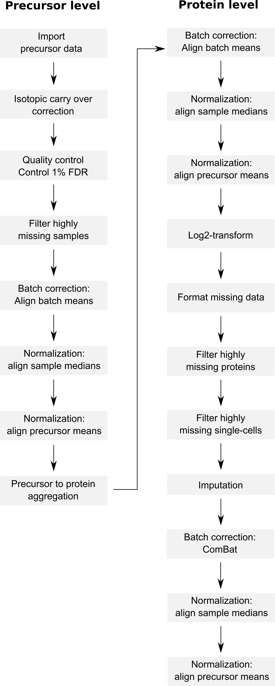

```{r setup, include = FALSE}
## Options for Rmarkdown compilation
knitr::opts_chunk$set(fig.width = 7,
                      fig.height = 5,
                      fig.align = "center",
                      out.width = "70%",
                      message = FALSE,
                      collapse = TRUE,
                      crop = NULL ## Related to https://stat.ethz.ch/pipermail/bioc-devel/2020-April/016656.html
)
## Time the compilation
timeStart <- Sys.time()
```

# Introduction

plexDIA ([Derks et al. 2022](http://dx.doi.org/10.1038/s41587-022-01389-w))
enables the profiling of the proteome of single cells using a 
multiplexed DIA data acquisition strategy. The pipeline includes the 
nPOP sample processing protocole ([Leduc et al. 2022](http://dx.doi.org/10.1101/2021.04.24.441211)),
with mTRAQ labeling of the samples. The authors used the DIA-NN 
software ([Demichev et al. 2022](http://dx.doi.org/10.1038/s41592-019-0638-x))
to identify and quantify the MS data. 

Let's first load the replication package to make use of some helper
functions. Those functions are only meant for this replication 
vignette and are not designed for general use. 

```{r, message = FALSE}
library("SCP.replication")
```

### `scp` and the plexDIA data analysis workflow

The code provided along with the article can be retrieved from
[this GitHub repository](https://github.com/SlavovLab/plexDIA).
The objective of this vignette is to replicate the analysis script 
while providing standardized, easy-to-read, and well documented code. 
Therefore, our first contribution is to formalize the data processing
into a conceptual flow chart.

```{r, results='markup', fig.cap="Overview of the processing workflow by Derks et al.", echo=FALSE, out.width='100%', fig.align='center'}

```

This replication vignette relies on a data framework dedicated to SCP
data analysis that combines two Bioconductor classes 
([Vanderaa et al. 2021](http://dx.doi.org/10.1080/14789450.2021.1988571)):

- The `SingleCellExperiment` class provides an interface to many 
cutting edge methods for single-cell analysis 
- The `QFeatures` class facilitates manipulation and processing of
MS-based quantitative data. 

The [`scp` vignette](http://www.bioconductor.org/packages/release/bioc/vignettes/scp/inst/doc/scp.html) 
provides detailed information about the data structure. The `scp` 
package extends the functionality of `QFeatures` for single-cell 
application. `scp` offers a standardized implementation for single-cell
processing methods.

The required packages for running this workflow are listed below.

```{r}
## Core packages of this workflow
library("scp")
library("scpdata")
library("sva")

## Utility packages for data manipulation and visualization
library("tidyverse")
library("ggbeeswarm")
library("ggrepel")
library("reshape2")
library("patchwork")
library("ggpointdensity")
```

### `scpdata` and the `leduc2022` dataset

We also implemented a data package called `scpdata`. It distributes
published SCP datasets, such as the `derks2022` dataset. The datasets
were downloaded from the data source provided in the publication and
formatted to a `QFeatures` object so that it is compatible with our
software. The underlying data storage is based on the `ExperimentHub`
package that provides a cloud-based storage infrastructure.

The `derks2022` dataset is provided at different levels of
processing:

* The **.raw and .d** files that were generated by the 
mass-spectrometers. This data is not included in `scpdata`. 
* The **DIA-NN main output report table** that contains the results of
the spectrum identification and quantification. 
* The **DIA-NN MS1 extracted signal table**, if a precursor was 
identified in at least one of the mTRAQ channels in the main report,
signal (if any) will be extracted from the other channels regardless
of whether there is sufficient evidence in those channels at 1% FDR.
* A **processed protein data table** is provided as the final output 
of the data processing. This workflow will try to replicate this 
table.

The workflow starts with precursor tables and will generate the 
processed protein data. The authors provided the DIA-NN output tables 
and the sample annotation table through a 
[Google Drive repo](https://drive.google.com/drive/folders/1pUC2zgXKtKYn22mlor0lmUDK0frgwL_-?usp=sharing).
Protein data are shared a TXT files. We highly value the effort the 
authors have made to publicly share all the data generated in their 
project, from raw files to final expression tables (see the Slavov Lab 
[website](https://scp.slavovlab.net/Derks_et_al_2022)).

### To include in `scpdata`

Actually, `derks2022()` is still in development and is not yet 
available from `scpdata`. The code below will soon be published in
`scpdata`. We here include it so that we can still run the vignette. 

```{r}
datadir <- "~/PhD/.localdata/SCP/derks2022/"

## Sample annotations

sampleAnnot <- read.delim(paste0(datadir, "Meta_SingleCell_updated_1.tsv"))
## Add which dataset each sample is part of
sampleAnnot$dataset <- sampleAnnot$Instrument
sampleAnnot$dataset[!sampleAnnot$Real_single_cell & 
                        sampleAnnot$Instrument == "Q-Exactive"] <- "bulk"
## Adapt variable to better match the DIANN output data
sampleAnnot$Label <- as.character(sampleAnnot$Label)
timsPath <- make.names("F:\\JD\\plexDIA\\Bruker\\OneDrive_1_3-9-2022\\")
qePath <- make.names("F:\\JD\\plexDIA\\nPOP\\")
sampleAnnot$File.Name <- ifelse(sampleAnnot$Instrument == "timsTOFSCP",
                                paste0(timsPath, sampleAnnot$Raw, ".d"),
                                paste0(qePath, sampleAnnot$Raw, ".raw"))

## Bulk data

# We load the DIA-NN main output table and the MS1 extracted report table.
# These are read and combined in a `QFeatures`object. 
extractedDataBulk <- read.delim(paste0(datadir, "qe_bulk/Report.pr_matrix_channels_ms1_extracted.tsv"))
reportDataBulk <- read.delim(paste0(datadir, "qe_bulk/Report.tsv"))
bulk <- readSCPfromDIANN(colData = sampleAnnot, 
                         reportData = reportDataBulk,
                         extractedData = extractedDataBulk,
                         multiplexing = "mTRAQ")
## Rename the MS1Extracted assay
names(bulk)[length(bulk)] <- "bulk_prec_extracted"

## Load timsTOF-SCP data

# We load the DIA-NN main output table and the MS1 extracted report table.
# These are read and combined in a `QFeatures`object. 
extractedDataTims <- read.delim(paste0(datadir, "tims_sc/Report.pr_matrix_channels_ms1_extracted.tsv"))
reportDataTims <- read.delim(paste0(datadir, "tims_sc/Report.tsv"))
# We modify the `Run` variable to match the `Run` variables in the other tables
reportDataTims$Run <- make.names(reportDataTims$Run)
tims <- readSCPfromDIANN(colData = sampleAnnot, 
                         reportData = reportDataTims,
                         extractedData = extractedDataTims,
                         multiplexing = "mTRAQ")
names(tims)[length(tims)] <- "tims_prec_extracted"

## Load Q-Exactive data

# We load the DIA-NN main output table and the MS1 extracted report table.
# These are read and combined in a `QFeatures`object. 
extractedDataQE <- read.delim(paste0(datadir, "qe_sc/Report.pr_matrix_channels_ms1_extracted.tsv"))
reportDataQE <- read.delim(paste0(datadir, "qe_sc/Report.tsv"))
qe <- readSCPfromDIANN(colData = sampleAnnot, 
                       reportData = reportDataQE,
                       extractedData = extractedDataQE,
                       multiplexing = "mTRAQ")
names(qe)[length(qe)] <- "qe_prec_extracted"

## Load protein data

prots <- read.delim(paste0(datadir, "Proteins_SC_IDs.txt"))
prots <- readSingleCellExperiment(prots, fname = "prot",
                                  ecol = grep("id", colnames(prots)))
colData(prots) <- DataFrame(sampleAnnot[sampleAnnot$id %in% colnames(prots), ])
colnames(prots) <- paste0(prots$File.Name, ".", prots$Label)

## Combine all datasets
## TODO implement a c() method to simplify this process...
derks2022 <- QFeatures(experiments = c(experiments(bulk), experiments(tims),
                                       experiments(qe)),
                       colData = rbind(colData(bulk), colData(tims), colData(qe)),
                       assayLinks = Reduce(append, list(bulk@assayLinks, tims@assayLinks, 
                                                        qe@assayLinks)))
derks2022 <- addAssay(derks2022, prots, name = "proteins", dropColData = TRUE)
derks2022 <- addAssayLink(derks2022, 
                          from = grep("extracted$", names(derks2022)),
                          to = "proteins",
                          varFrom = rep("Protein.Group", 3), 
                          varTo = "prot")

## Save data
## ...
```

**Stop "To include in `scpdata`"**

We formatted the `derks2022` dataset following our data framework. The 
formatted data can be retrieved from the `scpdata` package using the 
`derks2022()` function. All datasets in `scpdata` are called after 
the first author and the date of publication.

The `derks2022` data combines 3 main datasets: the 100-cell equivalent 
samples acquired with a Q-Exactive instrument, the single-cell samples 
acquired with a Q-Exactive instrument (we call this dataset `qe`), and
the the single-cell samples acquired with a timsTOF-SCP instrument (we
call this dataset `tims`). Each dataset contains the DIA-NN main report
data split over each run and the combined MS1 extracted data (see above
for more details). The data also contains the protein data for all 
samples as processed by the authors. 

```{r load_data}
# (scp <- derks2022())
(derks <- derks2022)
```
The datasets are stored in a `QFeatures` object. In total, it contains
66 different `SingleCellExperiment` objects 
that we refer to as **assays**. Each assay contains expression data 
along with feature metadata. Each row in an assay represents a 
**feature**, in this case a precursor or a protein depending on the 
assay. Each column in an assay represents a **sample**. During sample 
preparation, 3 samples are pooled using mTRAQ labeling, hence some 
assays contain 3 columns corresponding to each measured channel.

Using `plot()`, we can have a quick overview of the assays.

```{r}
plot(derks)
```

This figure is crowded, you can use `plot(derks, interactive = TRUE)`
to interactively explore this map. However, we can see that the 
different runs in the top of the figure converge to 3 assays that 
contain the extracted MS1 precursor signal for the three datasets: 
`bulk`, `tims` and `qe`. Finally, the protein table contains data 
derived from all three datasets.

The objective of this vignette is to replicate the combined protein
data table from the precursor assays following the same data processing
workflow as the original study by Derks et al. but using standardized
functionality.

We extract the `proteins` assay and keep it for later benchmarking. 
`getWithColData()` extract an assay of interest along with the 
associated sample annotations. We then remove the assay from the 
`S` object for the 
remainder of the processing. We apply
this using `removeAssays`.


```{r extract_SCoPE2_assays}
proteins_derks <- getWithColData(derks, "proteins")
derks <- removeAssay(derks, "proteins")
```

# Remove unwanted samples

Before starting the data processing, we remove the samples that are 
not considered by the authors to generate the protein data.
The timsTOF-SCP dataset was acquired with a few bulk 
samples diluted to single-cell equivalent. These samples are ending 
with `"_t_DB"`. The Q-Exactive dataset contains single-cells, but also
a dozen negative controls (encoded as `"Neg"`). 

```{r}
table(derks$Celltype, derks$dataset)
```

We remove those unwanted samples by accessing the information from the
`colData` using `subsetByColData()`. 

```{r}
derks <- subsetByColData(derks, !grepl("Neg|_t_DB", derks$Celltype))
```

# Isotopic carry over correction

The first data processing step is to correct for isotopic carry over
from one mTRAQ channel to another. This is performed using
`correctIsotopicCarryover()`. The function takes an assay and returns
the same assay with corrected quantifications. Since there are 3 
datasets, we will loop over the 3 assays containing the extracted MS1
signal. These corrected assays are added to the `QFeatures` object 
using `addAssay()` and the links between the precursors are added using


```{r}
for (i in c("bulk", "qe", "tims")) {
    inputAssay <- paste0(i ,"_prec_extracted")
    outputAssay <- paste0(i ,"_prec_corrected")
    x <- correctIsotopicCarryover(derks[[inputAssay]])
    derks <- addAssay(derks, x, name = outputAssay)
    derks <- addAssayLinkOneToOne(derks, from = inputAssay, 
                                  to = outputAssay)    
    cat("Finished correction for the", i, "dataset\n")
}
```

# Precursor FDR control

**!discussion** this is too complicated. Refactoring of 
filterFeatures in QFeatures would make this much easier.

**!discussion** There was a copy-paste issue in the original code: 
they used the scQE dataset instead of the bulkQE dataset... 

`PGs_0.01FDR <- SC[which(SC$Lib.PG.Q.Value<0.01),] %>% distinct(Protein.Group)`

Should have been

`PGs_0.01FDR <- B[which(B$Lib.PG.Q.Value<0.01),] %>% distinct(Protein.Group)`

```{r}
for (i in c("bulk", "qe", "tims")) {
    repAssays <- assayLink(derks, paste0(i ,"_prec_extracted"))@from
    rd <- rbindRowData(derks, repAssays)
    PGs_0.01FDR <- unique(rd$Protein.Group[rd$Lib.PG.Q.Value < 0.01])
    x <- derks[[paste0(i ,"_prec_corrected")]]
    ind <- rowData(x)$Protein.Group %in% PGs_0.01FDR
    derks[[paste0(i ,"_prec_corrected")]] <- x[ind, ]
    if (!all(ind)) 
        derks <- addAssayLink(derks, from = paste0(i ,"_prec_extracted"), 
                              to = paste0(i ,"_prec_corrected"),
                              varFrom = "Precursor.Id",
                              varTo = "Precursor.Id")
    cat("Finished FDR control for the", i, "dataset\n")
}
```

# Combine the datasets

Up to now, we kept the data belonging to each MS run in separate
assays. We now combine all batches into a single assay. This can
easily be done using the `joinAssays()` function from the `QFeatures`
package.

## Consensus mapping of precursors to proteins

We need to account for an issue in the data. `joinAssays()` will only
keep the metadata variables that have the same value between matching
rows. However, some precursors map to one protein group in one run
and to another protein group in another run. Hence, the protein group is
not constant for all precursors and is removed during joining. It is
important we keep the protein group information in the `rowData` since
we will later need it to aggregate precursors to proteins. To avoid 
this issue, we replace the problematic precursor to protein group 
mappings through a majority vote.

```{r}
## Generate a list of DataFrames with the information to modify
precAssays <- grep("corrected$", names(derks), value = TRUE)
ppMap <- rbindRowData(derks, i = precAssays) %>%
    data.frame %>%
    group_by(Precursor.Id) %>%
    ## The majority vote happens here
    mutate(Protein.Group =
               names(sort(table(Protein.Group),
                          decreasing = TRUE))[1]) %>%
    select(Precursor.Id, Protein.Group) %>%
    filter(!duplicated(Precursor.Id, Protein.Group))
consensus <- lapply(precAssays, function(i) {
    ind <- match(rowData(derks[[i]])$Precursor.Id, 
                 ppMap$Precursor.Id)
    DataFrame(Protein.Group = ppMap$Protein.Group[ind])
})
## Name the list
names(consensus) <- precAssays
## Modify the rowData
rowData(derks) <- consensus
```

We now join the three datasets in a single assay. This is performed 
using `joinAssays()`. 

```{r}
(derks <- joinAssays(derks, i = grep("corrected$", names(derks)),
                     name = "prec_corrected"))
```
The last assay, `prec_corrected` contains the data for all 3 datasets. 

# Filter missing data

Next, the authors require less than 60% missing data per cell. We 
compute the percent missing data for each column. We store it in the
`colData` using `derks$ <-` for later use. 

```{r}
derks$pNA <- colMeans(assay(derks[["prec_corrected"]]) == 0, na.rm = TRUE)
```

**!discussion**: I do not agree with how the missing data is computed. Missing
data is defined by the authors as the the number of zero values and
ignore the presence of NA's in the data... I don't understand why
ignoring the NA's, it dramatically underestimates the missingness.
Instead, I would have done as depicted in the chunk below although it 
considers the union of all proteins found in all 3 datasets and will . 

```{r, eval=FALSE}
derks <- zeroIsNA(derks, "prec_corrected")
derks$pNA <- nNA(derks, "prec_corrected")$nNAcols$pNA
```

We plot the percent missingness for each data set.  

```{r}
data.frame(colData(derks)) %>% 
    ggplot() +
    aes(y = pNA, 
        x = dataset, 
        color = Celltype) %>% 
    geom_beeswarm() +
    scale_size_manual(values = c(3, 0.8))
```

Most samples comply to the threshold. We remove the few single-cells 
with too many missing data using `subsetByColdata()` since we have
stored `pNA` in the `colData`. 

```{r}
derks <- subsetByColData(derks, derks$pNA < 0.6)
```

# Clean missing data

Log-transformation has generated infinite values because zeros were 
present in the data. We clean these infinite values and residual zero
by replacing them with NA's using `infIsNA()` and `zeroIsNA()`, 
respectively. 

```{r}
derks <- infIsNA(derks, "prec_corrected")
derks <- zeroIsNA(derks, "prec_corrected")
```

# Batch correction

The authors then apply a first batch correction by aligning the 
precursor means across the different acquisition runs. First, we 
extract the combined precursor assay along with the colData using 
`getWithColData()` and extract the quantification matrix from it using
`assay()`

```{r}
sce <- getWithColData(derks, "prec_corrected")
m <- assay(sce)
```

For each acquisition run, we divided each row by its mean. 

```{r}
for (batch in sce$File.Name) {
    ind <- which(sce$File.Name == batch) 
    m[, ind] <- sweep(m[, ind, drop = FALSE], FUN = "/", MARGIN = 1,
                      STATS = rowMeans(m[, ind, drop = FALSE], na.rm = TRUE))
}
assay(sce) <- m
```

We add the batch corrected values as a new assay using 
`addAssay()` and keep the links with the previous assay using 
`addAssayLinkOneToOne()`. 

```{r}
derks <- addAssay(derks, sce, name = "prec_runnorm", dropColData = TRUE)
derks <- addAssayLinkOneToOne(derks, from = "prec_corrected", to = "prec_runnorm")
```

**!discussion**: this type of batch correction is rather common and 
should be implemented in `scp` or maybe even in `QFeatures`. 

# Normalization

The next step is to apply normalization. The authors perform it at 
the sample level and the precursor level. 

## Median normalize per sample

Median normalization per sample is available among the methods from 
`normalizeSCP()`. It will automatically add a new assay that we call 
`prec_sampnorm`

```{r}
derks <- normalizeSCP(derks, "prec_runnorm", name = "prec_sampnorm",
                      method = "div.median")
```

## Mean normalize per precursor

Mean normalization per sample is not available among the methods from 
`normalizeSCP()`, but can be applied using `sweep()` offering more
flexibility.

```{r}
rowm <- rowMeans(assay(derks[["prec_sampnorm"]]), na.rm = TRUE)
derks <- sweep(derks, i = "prec_sampnorm", name = "prec_featnorm", 
               MARGIN = 1, FUN = "/", STATS = rowm)
```

# Protein aggregation

Up to now, the data was processed at the precursor level. Several
precursors belong to the same protein. One protein group is represented
by over 150 precursors.

```{r}
hist(table(rowData(derks[["prec_featnorm"]])$Protein.Group),
     xlab = "Number precursors per protein group", main = "")
```

We aggregate all precursors belonging to the same proteins. Median 
aggregation is performed using `aggregateFeatures()` and providing 
`fun = colMedians`. 

```{r}
derks <- aggregateFeatures(derks, i = "prec_featnorm", name = "prot",
                           fcol = "Protein.Group", fun = colMedians, 
                           na.rm = TRUE)
```

# Batch correction

After protein agregation, the authors perform again a batch correction 
round. We use the same approach as above.

```{r}
sce <- getWithColData(derks, "prot")
m <- assay(sce)
for (batch in sce$File.Name) {
    ind <- which(sce$File.Name == batch) 
    m[, ind] <- sweep(m[, ind, drop = FALSE], FUN = "/", MARGIN = 1,
                      STATS = rowMeans(m[, ind, drop = FALSE], na.rm = TRUE))
}
assay(sce) <- m
derks <- addAssay(derks, sce, name = "prot_runnorm", dropColData = TRUE)
derks <- addAssayLinkOneToOne(derks, from = "prot", to = "prot_runnorm")
```

# Normalization

Again, the batch correction is followed by sample and protein 
normalization. We use the same approach as above. 

```{r}
derks <- normalizeSCP(derks, "prot_runnorm", name = "prot_sampnorm",
                      method = "div.median")
rowm <- rowMeans(assay(derks[["prot_sampnorm"]]), na.rm = TRUE)
derks <- sweep(derks, i = "prot_sampnorm", name = "prot_featnorm", 
               MARGIN = 1, FUN = "/", STATS = rowm)
```

# Log-transform

The protein data is log2-transformed using `logTransform()`.

```{r}
derks <- logTransform(derks, i = "prot_featnorm", name = "prot_log",
                      base = 2)
```

# Clean missing data

Log-transformation has generated infinite values because zeros were 
present in the data. We clean these infinite values and residual zero
by replacing them with NA's using `infIsNA()` and `zeroIsNA()`, 
respectively. 

```{r}
derks <- infIsNA(derks, "prot_log")
derks <- zeroIsNA(derks, "prot_log")
```

# Filter missing data

Although we already performed a first filtering based on data 
missingness, we further filter on protein and sample missingness. 

## Filter on protein missingness

We filter out proteins with more than 95% missingness. This is 
performed using `filterNA()` that removes rows (proteins) with a 
missingness higher than the given threshold.

```{r}
derks <- filterNA(derks, i = "prot_log", pNA = 0.95)
```

## Filter on single-cell missingness

We then filter out samples with more than 95% missingness. This is 
performed using the same procedure as above. 

```{r}
derks$pNA <- colMeans(is.na(assay(derks[["prot_log"]])))
derks <- subsetByColData(derks, derks$pNA < 0.95)
```

**!discussion**: it would be nice to have a `byRow = TRUE` argument in
filterNA to filter based on row or columns. 

# Imputation

Although we filtered on missing data, the protein data is majorly
composed of missing values. The graph below shows the
distribution of the proportion missingness in cells. Cells contain on average
65 \% missing values. 

```{r}
data.frame(colData(derks)) %>% 
    ggplot() +
    aes(y = pNA, 
        x = dataset, 
        color = Celltype) %>% 
    geom_beeswarm()
```

The datasets containing single-cells have more than 50% missing data
that is imputed by the authors using a custom hierarchical clustering 
function. This function is available from `SCP.replication` as 
`imputeKnnSCoPE2()`. 

```{r}
derks <- imputeKnnSCoPE2(derks, i = "prot_log", name = "prot_imp", k = 3)
```

# Batch correction 

A final batch correction is applied, this time using the `ComBat`
algorithm from the `sva` package. 

```{r}
sce <- getWithColData(derks, "prot_imp")
batch <- sce$Label
mod <- model.matrix(~ Celltype, data = colData(sce))
assay(sce) <- ComBat(assay(sce), batch = batch, mod = mod)
derks <- addAssay(derks, sce, name = "prot_bc", dropColData = TRUE)
derks <- addAssayLinkOneToOne(derks, from = "prot_imp", to = "prot_bc")
```

# Normalization

Again, the batch correction is followed by sample and protein 
normalization. We use the same approach as above. 

```{r}
derks <- normalizeSCP(derks, "prot_bc", name = "prot_bc_sampnorm",
                      method = "center.median")
rowm <- rowMeans(assay(derks[["prot_bc_sampnorm"]]), na.rm = TRUE)
derks <- sweep(derks, i = "prot_bc_sampnorm", name = "prot_bc_featnorm", 
               MARGIN = 1, FUN = "-", STATS = rowm)
```

This last normalization step leads to the final data as processed by
Derks et al. We will now compare our results with the results published
by the authors. 

# Benchmark final data

Let's first compare the filtered cells. 

```{r}
allElements <- union(colnames(proteins_derks), 
                     colnames(derks[["prot_bc_featnorm"]]))
table(derks2022 = allElements %in% colnames(proteins_derks),
      scp = allElements %in% colnames(derks[["prot_bc_featnorm"]]))
```
There is a good agreement between the set of filtered cells after the
data processing by the authors and the data processing in this 
vignette. 

Let's now compare the filtered protein groups. 

```{r}
allElements <- union(rownames(proteins_derks), 
                     rownames(derks[["prot_bc_featnorm"]]))
table(derks2022 = allElements %in% rownames(proteins_derks),
      scp = allElements %in% rownames(derks[["prot_bc_featnorm"]]))
```

Most protein groups are found in both data processing workflows, but
the agreement is weak. 

Let's now compare the quantitative data between the two matrices. To
do so, we need to intersect the column names and the rownames. 

```{r}
rows <- intersect(rownames(proteins_derks),
                  rownames(derks[["prot_bc_featnorm"]]))
cols <- intersect(colnames(proteins_derks),
                  colnames(derks[["prot_bc_featnorm"]]))
err <- assay(proteins_derks)[rows, cols] - 
    assay(derks[["prot_bc_featnorm"]])[rows, cols]
data.frame(difference = as.vector(err[!is.na(err)])) %>%
    ggplot() +
    aes(x = difference) +
    geom_histogram(bins = 50) +
    xlab("plexDIA - scp") +
    scale_y_continuous(labels = scales::scientific) +
    theme_minimal()
```

There are very large differences between the two workflows. Note that
the differences are computed on a log2 scale. However, the mode of the 
distribution peaks around 0.

# Number precursors per cell

```{r, eval=FALSE, echo=FALSE, fig.height=6, fig.width=8}
derks <- countUniqueFeatures(derks, i = "prec_corrected", colDataName = "nprecs")
derks <- countUniqueFeatures(derks, i = "prec_corrected", groupBy = "Protein.Ids",
                             colDataName = "nprots")
```

```{r, eval=FALSE, echo=FALSE, fig.height=6, fig.width=8}
df <- data.frame(colData(derks))
ggplot(df) +
    aes(x = Celltype, y = nprecs, fill = Celltype) +
    facet_wrap(~ dataset, scales = "free") +
    labs(y = "Precursors per cell") +
    ggplot(df) +
    aes(x = Celltype, y = nprots, fill = Celltype) +
    facet_wrap(~ dataset, scales = "free") +
    labs(y = "Protein groups per cell") +
    plot_layout(guides = "collect", ncol = 1) &
    geom_boxplot(alpha = 0.8) &
    geom_beeswarm(show.legend = FALSE, alpha = 0.7) &
    xlab("") &
    theme_classic() &
    theme(legend.position = "none")
```

# Bulk vs single-cell

```{r}
sce <- getWithColData(derks, "prot_imp")
m <- assay(sce)
logFC <- data.frame(PvsU_tims = rowMeans(m[, sce$Celltype == "PDAC_t"], na.rm = TRUE) - 
                        rowMeans(m[, sce$Celltype == "U-937_t"], na.rm = TRUE),
                    PvsU_qe = rowMeans(m[, sce$Celltype == "PDAC"], na.rm = TRUE) - 
                        rowMeans(m[, sce$Celltype == "U-937"], na.rm = TRUE),
                    PvsU_bulk = rowMeans(m[, sce$Celltype == "PDAC_DB"], na.rm = TRUE) -
                        rowMeans(m[, sce$Celltype == "U-937_DB"], na.rm = TRUE),
                    Protein.Group = rownames(m))
logFC <- left_join(logFC, data.frame(Protein.Group = c("P17096;P17096-3", "P07437", "P08729"),
                                     Protein.Name = c("HMGA1", "TUBB", "KRT7")), 
                   by = c("Protein.Group"))
```


```{r}
ggplot(logFC) +
    aes(x = PvsU_bulk, 
        y = PvsU_qe) +
    ggtitle("Q-Exactive vs Bulk",
            subtitle = paste0("rho = ", round(cor(logFC$PvsU_qe, 
                                                  logFC$PvsU_bulk, 
                                                  use = "pairwise.complete.obs",
                                                  method = "spearman"), 2))) +
    labs(x = expression(paste(Log["2"],", PDAC/U-937 100 cells")), 
         y = expression(paste(Log["2"],", PDAC/U-937 1 cell (Q-Exactive)"))) +
    ggplot(logFC) +
    aes(x = PvsU_bulk, 
        y = PvsU_tims) +
    ggtitle("timsTOF-SCP vs Bulk",
            subtitle = paste0("rho = ", round(cor(logFC$PvsU_tims, 
                                                  logFC$PvsU_bulk, 
                                                  use = "pairwise.complete.obs",
                                                  method = "spearman"), 2))) +
    labs(x = expression(paste(Log["2"],", PDAC/U-937 100 cells")), 
         y = expression(paste(Log["2"],", PDAC/U-937 1 cell (timTOF-SCP)"))) +
    plot_layout() &
    geom_pointdensity() &
    scale_color_continuous(type = "viridis") &
    theme_classic() &
    theme(legend.position = "none") &
    geom_label_repel(aes(label = Protein.Name),
                     min.segment.length = unit(0, 'lines'),
                     box.padding = 2,
                     size = 2.75) 
```

# PCA

We here plot the PCA to reproduce Figure 6p from the author's paper. 
Although the we could not accurately reproduce the data provided by the
authors, we can clearly see the same global pattern as in the original
work.

```{r}
m <- assay(derks[["prot_bc_featnorm"]])
pcaRes <- pcaSCoPE2(m)
## Percent of variance explained by each principle component
pca_var <- pcaRes$values
percent_var<- pca_var/sum(pca_var)*100
## PCA scores data
pcaDf <- data.frame(PC = pcaRes$vectors[, 1:2],
                    colData(derks))
pcaDf$Type <- pcaDf$Celltype
pcaDf$Type[grepl("DB", pcaDf$Celltype)] <- "Bulk"
pcaDf$Type[grepl("t$", pcaDf$Celltype)] <- "timsTOF-SCP"
pcaDf$Type[!grepl("[_]", pcaDf$Celltype)] <- "Q-Exactive"
pcaDf$Celltype[grepl("PDAC", pcaDf$Celltype)] <- "PDAC"
pcaDf$Celltype[grepl("Mel", pcaDf$Celltype)] <- "Melanoma"
pcaDf$Celltype[grepl("^U", pcaDf$Celltype)] <- "Monocyte"
pcaDf$Label <- paste0("mTRAQ", pcaDf$Label)
## Plot    
ggplot(pcaDf) +
    aes(color = Label) + 
    scale_color_manual(values = c("orange2","purple","turquoise")) +
    ggplot(pcaDf) +
    aes(color = Celltype) + 
    scale_color_manual(values = c("#52B788","#457B9D","#E07A5F")) +
    plot_annotation(title = "PCA of the processed data using 'scp'",
                    subtitle = paste0(sum(pcaDf$Type != "Bulk"), " cells\n",
                                      nrow(m), " protein groups")) +
    plot_layout(guides = "collect") &
    
    aes(x = PC.1, 
        y = PC.2, 
        size = Type,
        shape = Type, 
        alpha = Type) &
    geom_point(alpha = 0.66) &
    labs(x = paste0("PC1 (", round(percent_var[1],0),"%)"), 
         y = paste0("PC2 (", round(percent_var[2],0),"%)")) &
    scale_size_manual(values = c(5, 2, 2)) &
    theme_classic()
```

# Requirements

### Hardware and software

The system details of the machine that built the vignette are:

```{r, echo = FALSE, message = FALSE}
sd <- benchmarkme::get_sys_details()
cat("Machine: ", sd$sys_info$sysname, " (", sd$sys_info$release, ")\n",
    "R version: R.", sd$r_version$major, ".", sd$r_version$minor,
    " (svn: ", sd$r_version$`svn rev`, ")\n",
    "RAM: ", round(sd$ram / 1E9, 1), " GB\n",
    "CPU: ", sd$cpu$no_of_cores, " core(s) - ", sd$cpu$model_name, "\n",
    sep = "")
```

### Timing

The total time required to compile this vignette is:

```{r, echo = FALSE}
timing <- Sys.time() - timeStart
cat(timing[[1]], attr(timing, "units"))
```

### Memory

The final `leduc` object size is:

```{r, echo = FALSE}
format(object.size(derks), units = "GB")
```

### Session info

```{r}
sessionInfo()
```


